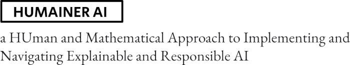

 

The NWO-funded project HUMAINER AI (KIVI.2019.006) addresses several challenges of trustworthy AI in the context of service provision.

  

**Outcomes:**

- 2022.12. Conference Paper (WP2): Fratrič, P., Sileno, G., Klous, S., van Engers, T., *A compression and simulation-based approach to fraud discovery*, Proceedings of the 35th International Conference on Legal Knowledge and Information Systems (JURIX 2022) 
- 2022.11. Conference Paper (WP1): Skoric, V., Sileno, G., Ghebreab, S., *Legality, Legitimacy, and Instrumental Possibility in Human and Computational Governance for the Public Sector*, International Forum on Digital and Democracy, 2nd edition (IFDaD 2022) 
- 2022.09. Conference Paper (WP2): Wilms, M., Sileno, G., and Haned, H., *PEBAM: A Profile-based Evaluation Method for Bias Assessment on Mixed Datasets.*, Proceedings of KI 2022, 45th German Conference on Artificial Intelligence. 
- 2022.07. Conference Paper (WP2): Fratrič, P., Sileno, G., Klous, S., van Engers, T., *Computational Discovery of Transaction-Based Financial Crime via Grammatical Evolution: the Case of Ponzi Schemes*, Proceedings of COINE 2022: International Workshop on Coordination, Organizations, Institutions, Norms and Ethics for Governance of Multi-Agent Systems, co-located with AAMAS 2022.
- 2022.05. Journal Paper (WP2): Fratrič, P., Sileno, G., Klous, S., van Engers, T., *Manipulation of the Bitcoin market: an agent-based study*, Financial Innovation 8 (1), 1-29 
- 2022.01. Presentation (WP1): Sileno, G., Van Binsbergen, T., Pascucci, M., van Engers, T., DPCL: a language template for normative specifications, Workshop on Programming Languages and the Law (ProLaLa 2022), co-located with POPL 2022
- 2021.12. Conference Paper (WP1): Pascucci, M., Sileno, G., *Computability of diagrammatic theories for normative positions*, Proceedings of the 34th International Conference on Legal Knowledge and Information Systems (JURIX 2021)
- 2021.09. Paper (WP1): Sileno, G., Grosso, P., *Accounting Value Effects for Responsible Networking*, Proceedings of ACM SIGCOMM 2021 Workshop on Technologies, Applications, and Uses of a Responsible Internet (TAURIN2021)
- 2021.07. Paper (WP1): Pascucci, M., Sileno, G., *The Search for Symmetry in Hohfeldian Modalities*, Proceedings of 12th International Conference on the Theory and Application of Diagrams (DIAGRAMS2021).

   

